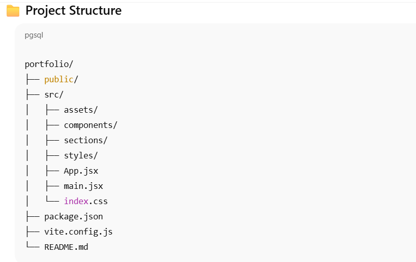

🌐 Personal Portfolio – Ishika Pal

A modern, fully responsive personal portfolio website built using React, Vite, TailwindCSS, Framer Motion, and Three.js.
This portfolio showcases my work, skills, certifications, and achievements with smooth animations, 3D elements, and a clean professional UI.

🔗 Live Link: https://ishikaapal.github.io/portfolio

(Works after deployment)

🚀 Tech Stack

React 19

Vite

TailwindCSS v4

Framer Motion / Motion One

GSAP

React Three Fiber

Three.js

Lucide Icons & React Icons

Lenis Smooth Scroll

🎯 Features

✨ Modern UI/UX

Fully responsive layout

Smooth animations and transitions

Interactive 3D elements

Fast load times using Vite

Custom reusable components

📌 Sections Included

Hero Section

About Me

Skills

Projects

Certifications

Contact Section

🧭 Extra Enhancements

Parallax & tilt card effects

Smooth scrolling experience

Clean component architecture

Easy to customize

🔧 Installation & Setup

1. Clone the repository
git clone https://github.com/Ishikaapal/portfolio.git
cd portfolio

2. Install dependencies
npm install

3. Run the development server
npm run dev

4. Create production build
npm run build

🚀 Deployment (GitHub Pages)

This project uses gh-pages for deployment.

Deploy using:
npm run deploy

After deployment, your portfolio will be live at:

👉 https://ishikaapal.github.io/portfolio

🧑‍💻 Author – Ishika Pal
    Frontend Developer

🔗 GitHub: https://github.com/Ishikaapal

📜 License

This project is open-source and available under the MIT License.